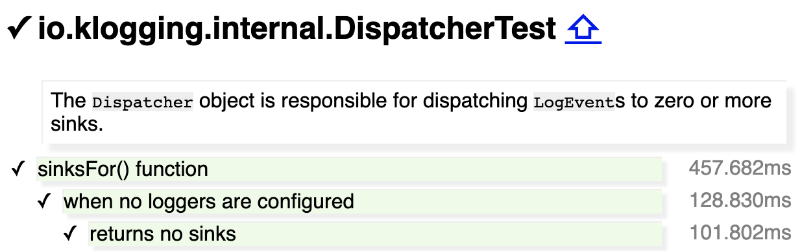

# Kotest HTML Reporter

[](https://opensource.org/licenses/Apache-2.0)
[](https://github.com/mjstrasser/kotest-html-reporter/actions/workflows/build.yml)
[](https://central.sonatype.com/search?q=a:kotest-html-reporter)

A [Kotest](https://kotest.io) [framework extension](https://kotest.io/docs/framework/extensions/extensions-introduction.html)
for reporting test results in a single HTML file.

[This example](https://kotest-html-reporter.michaelstrasser.com) is the most recent report of the tests of Kotest HTML
Reporter itself. It deliberately includes failing tests to demonstrate how those are rendered in a report.

## What is it?

Kotest HTML Reporter is intended to be used with meaningful test descriptions, in any Kotest style, to create useful
specifications of the software under test.

### Feature: inline Markdown conversion

Kotest HTML Reporter converts inline Markdown in the names of specs and tests. It renders `code`,
_italic_ and **bold** test as expected.

### Feature: `description` extension property for specs

The `description` extension property for specs enables you to describe the class or feature that is being tested by a
spec. For example:

```kotlin
internal class DispatcherTest : DescribeSpec({
    description(
        """
        | The `Dispatcher` object is responsible for dispatching `LogEvent`s to zero
        | or more sinks.
    """.trimMargin()
    )
    describe("sinksFor() function") {
        describe("when no loggers are configured") {
            it("returns no sinks") {
                loggingConfiguration { }
                Dispatcher.sinksFor(randomString(), randomLevel()) shouldHaveSize 0
            }
        }
        // ...
    }
})
```

is rendered as:



## Quick start

Add Kotest HTML Reporter to your Gradle project.

> Kotest version 6 has some breaking changes and is supported by version 0.8 and above of this
> extension. If you are using an earlier version of Kotest (e.g. 5.9.1) then use version 0.7.3 of
> this extension.

### Kotest versions below 6

```kotlin
dependencies {
    // ...
    testImplementation("io.kotest:kotest-runner-junit5:5.9.1")
    testImplementation("com.michaelstrasser:kotest-html-reporter:0.7.3")
}
```

Configure Kotest to use HTML Reporter:

```kotlin
import io.kotest.core.config.AbstractProjectConfig
import io.kotest.core.extensions.Extension
import mjs.kotest.HtmlReporter

/** Create an HTML report for every test run. */
object KotestConfig : AbstractProjectConfig() {
    override fun extensions(): List<Extension> = listOf(
        HtmlReporter(),
    )
}
```

### Kotest versions 6 and above

```kotlin
dependencies {
    // ...
    testImplementation("io.kotest:kotest-runner-junit5:6.0.0")
    testImplementation("com.michaelstrasser:kotest-html-reporter:0.8.1")
}
```

Configure Kotest to use HTML Reporter like this:

```kotlin
package com.thing

import io.kotest.core.config.AbstractProjectConfig
import io.kotest.core.extensions.Extension
import mjs.kotest.HtmlReporter

/** Create an HTML report for every test run. */
object KotestConfig : AbstractProjectConfig() {
    override val extensions: List<Extension> = listOf(
        HtmlReporter(),
    )
}
```

Place a `kotest.properties` file in your `src/test/resources` directory with a line that specifies
the fully qualified name of your configuration class or object:

```properties
kotest.framework.config.fqn=com.thing.KotestConfig
```

### Using snapshot builds

If you want to use snapshot builds of Kotest HTML Reporter, specify these in your Gradle build:

```kotlin
repositories {
    // ...
    maven("https://central.sonatype.com/repository/maven-snapshots/")
}

```

```kotlin
dependencies {
    // ...
    testImplementation("io.kotest:kotest-runner-junit5:6.0.0")
    testImplementation("com.michaelstrasser:kotest-html-reporter:0.9.0-SNAPSHOT")
}
```

## Configuration options

Kotest HTML Reporter accepts these configuration options, here showing default values:

```kotlin
HtmlReporter(
    outputDir = "reports/kotest",
    reportFilename = "kotest-report.html",
)
```

- `outputDir`: output directory, relative to Gradle build directory.
- `reportFilename`: name of the HTML report file.

### Environment variables

These environment variables affect the generated output.

* `GIT_COMMIT`: Display the commit identifier of the build that generated the report.
* `GIT_MESSAGE`: Display the commit message of the build that generated the report.
* `TIMEZONE`: Display the timestamp using this timezone. The specified value is passed to the Java `ZoneId.of()` method.

This project’s [GitHub Actions build file](.github/workflows/build.yml#L19) shows an example of setting these variables.

## Example report

Here is an example report showing the table of contents and expansion of a stacktrace.


