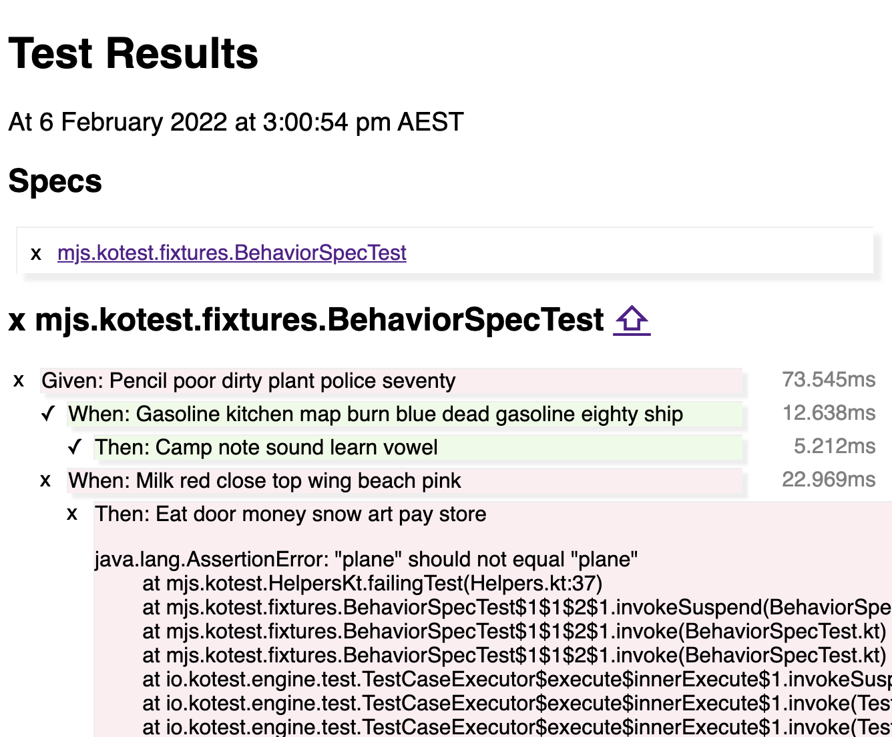

# Kotest HTML Reporter

[](https://opensource.org/licenses/Apache-2.0)
[](https://github.com/mjstrasser/kotest-html-reporter/actions/workflows/build.yml)
[](https://search.maven.org/search?q=a:kotest-html-reporter)

A [Kotest](https://kotest.io) [framework extension](https://kotest.io/docs/framework/extensions/extensions-introduction.html)
for reporting test results in a single HTML file.

It is intended to be used with meaningful test descriptions, in any Kotest style, to create useful specifications of the
software under test.

🚧 **Kotest HTML Reporter is early-stage work in progress** 🚧

## Quick start

Add Kotest HTML Reporter to your Gradle project, for example:

```kotlin
    testImplementation("io.kotest:kotest-runner-junit5:5.1.0")
testImplementation("com.michaelstrasser:kotest-html-reporter:0.3.0")
```

Configure Kotest to use HTML Reporter:

```kotlin
import io.kotest.core.config.AbstractProjectConfig
import io.kotest.core.extensions.Extension
import mjs.kotest.HtmlReporter

/** Create an HTML report for every test run. */
object KotestConfig : AbstractProjectConfig() {
    override fun extensions(): List<Extension> = listOf(
        HtmlReporter(),
    )
}
```

## Configuration options

Kotest HTML Reporter accepts these configuration options, here showing default values:

```kotlin
HtmlReporter(
    outputDir = "reports/kotest",
    reportFilename = "kotest-report.html",
    writeJsonReports = false,
)
```

- `outputDir`: output directory, relative to Gradle build directory.
- `reportFilename`: name of the HTML report file.
- `writeJsonReports`: write JSON serialisations of the internal `SpecReport` and `TestReport` data classes. May be
  useful for understanding how HTML Reporter works.

## Example report


